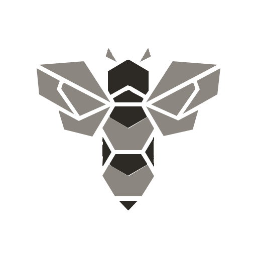

# Open Agent Team

<p align="center">
  
</p>

<p align="center">
  <a href="https://www.npmjs.com/package/open-agent-team"></a>
  <a href="https://www.npmjs.com/package/open-agent-team"></a>
</p>


This project lets you build a declarative **agent team** with a 3-layer hierarchy:

`Admin -> Leader -> Worker`

You declare roles, models, shared skills, and workspace/git strategies in `team.json`. At runtime, the Orchestrator starts all agents (`Admin`, `Leader`s, and a pre-spawned `Worker` pool) and `Leader`s dispatch tasks to `Worker`s. Each `Worker` must update a `CHANGELOG.md`, which is merged upward:

`Worker CHANGELOG` -> `Leader CHANGELOG` -> final `Admin` summary. All roles are strictly instructed to **APPEND** to their respective `CHANGELOG.md` files.

## Quick Start

### 1. Install

```bash
npm i open-agent-team -g
```

### 2. Create `team.json`

Create a `team.json` in your project root (see [team.example.json](./team.example.json) for a full example):

```bash
oat init
```

### 3. Start your team

```bash
oat start team.json
```

### 4. Open the dashboard

```bash
oat dashboard
```

## Key concepts

### Declarative configuration (`team.json`)

- `team.json` defines:
  - global default model (`model`, optional)
  - global provider integration (`providers`, optional)
  - project metadata (`project`; `project.base_branch` must be `main` or `master`, default `main`)
  - model alias mapping (`models`)
  - `Admin` agent config (`admin`)
  - team configs (`teams[]`: `Leader` + `Worker`)
- If `admin.prompt` / `leader.prompt` / `worker.prompt` ends with `.md`, the loader treats it as a file path and loads the file content as prompt text.
- Model inheritance chain: `worker.model -> leader.model -> admin.model -> model` (you can override at any level).

See the detailed field reference: `oat docs config --lang en`.

### Isolated workspaces (git worktree)

By default, each agent runs in an isolated workspace created via `git worktree`, under:

- `workspace.root_dir` (default: `<team.json dir>/workspaces`)

For large repos, sparse-checkout can be enabled; worker sparse-checkout paths come from `teams[].leader.repos`.

### Skills management (`npx skills`)

Skills are managed via [`npx skills`](https://github.com/vercel-labs/skills) and declared in `team.json` as `SkillEntry` objects:

- Each entry specifies a `source` (GitHub repo, URL, or local path) and optional `names` filter
- On startup, OAT runs `npx skills add` for each entry and installs skills into `<workspace>/skills/`
- A `.pi/skills` symlink is created for pi-coding-agent compatibility

### CHANGELOG-driven collaboration

When initializing agents, the Orchestrator injects system constraints:

- All roles (Admin, Leader, Worker) MUST append to `CHANGELOG.md` at their workspace root (even if there are no code changes, record the reasoning).
- All daily intermediate outputs (notes, drafts, logs) must be saved under `.oat/workspaces/<agentId>/records/<date>/`.
- Worker and Leader call `notify-complete` and pass the prepared `CHANGELOG.md` content to propagate it upwards.

## Quick start

### 1) Configure skills (optional)

Declare skill sources in `team.json` using the `SkillEntry` format:

```json
"skills": [{ "source": "vercel-labs/agent-skills", "names": ["frontend-design"] }]
```

### 2) Create `team.json`

Refer to:

- `docs/en/guide.md` (minimal example + run steps)
- `docs/en/config.md` (field-by-field reference)

### 3) Start Orchestrator

```bash
oat start team.json [goal]
```

The `--port` flag is optional — OAT auto-scans for an available port starting from 8787.

Choose output/docs language:

```bash
oat start team.json [goal] --lang zh-CN
```

The built-in **Web Dashboard** is available at `http://localhost:<port>`, offering real-time observability, online project configuration editing (with Shiki JSON preview), global settings management, and multi-team project management. It also features a **Project Achievements** page to browse the daily work records and `CHANGELOG.md` history of each agent. The dashboard uses lazy-loading and code splitting for optimal performance.

### 4) Useful commands

```bash
oat list
oat stop
oat docs architecture --lang en
oat docs config --lang en
oat docs guide --lang en
```

## How collaboration works (high level)

1. Orchestrator installs skills via `npx skills add`, starts `Admin`, each `Leader`, and pre-spawns a `Worker` pool (size = `teams[].worker.total`).
2. A `Leader` calls the tool `dispatch-worker-tasks` with a list of `tasks`.
3. Orchestrator dispatches tasks to the pre-spawned `Worker` pool:
   - connects to the target worker
   - sends the task prompt
4. `Worker` must:
   - append to `CHANGELOG.md` at the workspace root
   - call `notify-complete` with the prepared `CHANGELOG.md` content
5. Orchestrator auto-commits all changes (`git add -A && git commit`), then merges `Worker -> Leader`, asks `Leader` to summarize, then merges `Leader -> project.base_branch`.
6. Each agent's git commits are attributed with a unique local identity (e.g., `worker-0-teamName@project-projectName.oat`).
7. Orchestrator keeps the worker pool until shutdown; only `stopAll` on orchestrator exit stops/destroys processes.

## Current implementation notes (aligned with code)

- Runtime mode: `local_process` is implemented (Orchestrator starts multiple agent processes on different ports).
- Workspaces: `worktree` provider is implemented; other providers are placeholders.
- Worker pool size intent (`teams[].worker.total`) is enforced by pre-spawning workers at team startup; workers are not cleaned up after a leader completes (only on orchestrator shutdown).

## Other languages

- `README.en.md`
- `README.zh-CN.md`
- `README.fr.md`
- `README.ja.md`

## Acknowledgments

- [CLIProxyAPI Management Console (CPAMC)](https://github.com/router-for-me/CLIProxyAPI) — Dashboard design system (theme, layout, and glass effects) is ported from CPAMC's UI.

## Star History

<a href="https://star-history.com/#HerbertHe/open-agent-team&Date">
  <picture>
    <source media="(prefers-color-scheme: dark)" srcset="https://api.star-history.com/svg?repos=HerbertHe/open-agent-team&type=Date&theme=dark" />
    <source media="(prefers-color-scheme: light)" srcset="https://api.star-history.com/svg?repos=HerbertHe/open-agent-team&type=Date" />
    
  </picture>
</a>

## LICENSE

MIT &copy; Herbert He
