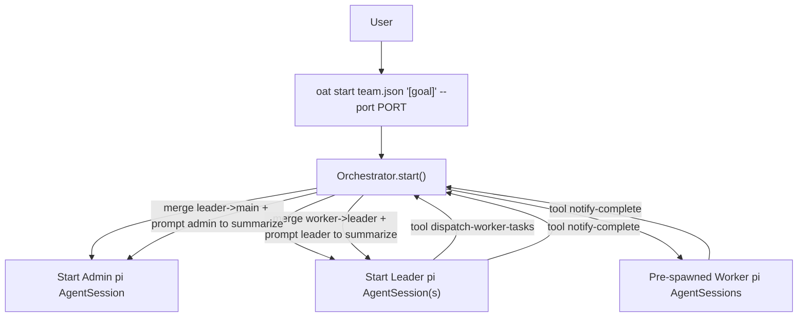

# Agent Team Architecture (Orchestrator + pi-coding-agent)

## 1. Overview: How the declarative team is realized

This project provides a "declarative agent team" workflow: you declare `Admin / Leader / Worker` roles, models, skills, and team branch/workspace strategies in `team.json`; at runtime the Orchestrator reads the config and does the following:

- Start `Admin`, each Team's `Leader`, and pre-spawn the `Worker` pool (these remain running until a leader finishes and triggers cleanup)
- `Leader` dispatches tasks to pre-spawned `Worker` agents via the `dispatch-worker-tasks` tool
- `Worker` works inside its own isolated git worktree workspace, making concrete changes and producing `CHANGELOG.md`
- Orchestrator merges each `Worker` branch back into the corresponding `Leader` branch, and asks `Leader` to summarize the workers' CHANGELOGs
- After each `Leader` completes aggregation, Orchestrator merges the leader branch into `project.base_branch`, and asks `Admin` for the final delivery summary and report

The relationships can be understood as:

- `Admin`: the project manager (final aggregation & delivery)
- `Leader`: the team lead (breaks down tasks, schedules workers, aggregates results)
- `Worker`: the engineer (executes tasks, submits changes, writes CHANGELOG)

## 2. Component split (code module responsibilities)

### Orchestrator (the orchestration entry)

Orchestrator lives in `src/orchestrator/orchestrator.ts` and is mainly responsible for:

- Computing each agent's `workspacePath`, models, and skills based on `ResolvedConfig`
- Injecting and starting `Admin` and all `Leader` agents (as in-process pi AgentSessions)
- Registering Orchestrator HTTP tool routes (accessible via dashboard and external REST)
- Writing workspace metadata (`.oat/*`) into each workspace via `src/pi/workspace-inject.ts`
- Creating custom pi tools (`defineTool`) that directly call TaskManager, eliminating the need for HTTP tool callbacks

At startup, Orchestrator primarily:

1. Generates and starts `Admin` and `Leader` (static agents) as pi AgentSessions
2. Pre-spawns the worker pool for each team
3. Starts an HTTP server for the dashboard and observability endpoints

### TaskManager (dynamic scheduling and merge back-report)

The dynamic part is handled by `src/orchestrator/task-manager.ts`. Its core responsibilities are:

- Accept `Leader` requests via tools: `dispatch-worker-tasks`
- Create a `Worker` pi AgentSession for each task at startup (worktree workspace + skill installation via `npx skills` + in-process session start)
- Accept completion notifications from `Worker`/`Leader` via `notify-complete` tool
- Perform git merges:
  - `Worker` branch -> `Leader` branch
  - `Leader` branch -> `project.base_branch`
- Ask `Leader`/`Admin` to summarize based on CHANGELOG
- Cleanup (dispose session + optionally remove workspace)

### PiSessionProvider (how pi AgentSessions are managed)

The runtime implementation is `PiSessionProvider`, implemented in `src/sandbox/local-process.ts`:

- Creates an in-process pi `AgentSession` for each agent (no separate OS process)
- Each session is bound to the agent's `workspacePath` as its working directory (`cwd`)
- Custom orchestration tools are passed as `customTools` closures — they call `TaskManager` methods directly
- Agent system prompt is set via `DefaultResourceLoader.systemPromptOverride`
- `stop` calls `session.dispose()` to clean up the in-process session

> Extension point: `RuntimeModeEnum` exists as an enum value in code, but the current implementation focuses on `local_process` (pi in-process).

### WorkspaceProvider (workspace isolation and git worktree management)

Workspace strategy is provided by `src/workspace/workspace-provider.ts` factory. By default it uses `WorktreeWorkspaceProvider`:

- Create a git worktree workspace per agent/branch: directory like `<workspace.root_dir>/<spec.id>`
- Use `sparse-checkout` to reduce large repo footprint (paths are allowed by `team.leader.repos`)
- Optionally execute `git lfs pull`
- If a workspace directory exists but the git worktree reference is broken (e.g., cleaned up by a previous run), it is automatically detected and rebuilt
- Cleanup by `git worktree remove --force` and deleting the directory

> Extension point: `workspace.provider` currently only materializes `worktree`. Other strategies (`shared_clone/full_clone`) remain placeholder implementations in the factory.

### SkillResolver (install skills into workspace via `npx skills`)

Implemented in `src/skills/skill-resolver.ts`:

- For each `SkillEntry` in the agent's config, runs `npx skills add <source> --skill <name> -a openclaw --copy -y` with `cwd` set to the workspace
- Skills are installed into `<workspacePath>/skills/<skill-name>/SKILL.md`
- Creates a `.pi/skills` → `skills` symlink so pi-coding-agent's `DefaultResourceLoader` can discover them

### Git + documentation pipeline: MergeManager / ChangelogManager / GitIdentity

- `src/git/merge-manager.ts`: performs `merge --no-ff` for `worker->leader` and `leader->main`
- `src/changelog/changelog-manager.ts`: reads `CHANGELOG.md` from the workspace root directory
- `src/git/git-identity.ts`: sets `--local` git identity (`user.name` / `user.email`) for each agent workspace, and auto-commits changes on `notify-complete`

#### Git Identity Rules

| Role | `user.name` format | `user.email` format |
|------|-------------------|--------------------|
| Admin | `{projectName}-{adminName}` | `admin@project-{projectName}.oat` |
| Leader | `{teamName}-leader-{leaderName}` | `leader-{teamName}@project-{projectName}.oat` |
| Worker | `{teamName}-worker-{index}` | `worker-{index}-{teamName}@project-{projectName}.oat` |

Identity is set during `oat start` via `git config --local`, scoped to the workspace directory. Repeated starts automatically overwrite.

## 3. Runtime flow (from start to delivery)

Below is the end-to-end "main flow":



### 3.1 Startup phase: Admin + Leader injection

Orchestrator sets up each static agent:

- Create workspace (worktree provider)
- Install skills via `npx skills add` and write `.oat/* meta` (via `src/pi/workspace-inject.ts`)
- Build `defineTool` orchestration tools (closures over TaskManager)
- Create pi AgentSession via `createAgentSession({ cwd: workspacePath, customTools, systemPrompt })`

Key injection is implemented in `src/pi/workspace-inject.ts`:

- `writeAgentWorkspaceConfig()`: writes `.oat/scope.json`, `.oat/orchestrator.json`, `.oat/agent.json`
- `buildAgentSystemPrompt()`: builds the system prompt (agent persona + role instructions + records path rules)
- Custom orchestration tools are defined in `orchestrator.ts` using `defineTool()` from `@mariozechner/pi-coding-agent`

### 3.2 Worker task dispatch: Leader dispatches tasks

`Leader` calls the `dispatch-worker-tasks` tool:

```json
{ "tasks": [ { "index": 0, "prompt": "..." }, { "index": 1, "prompt": "..." } ] }
```

Orchestrator handles this in `TaskManager.dispatchWorkerTasks()`:

- For each task allocates:
  - `workerId = <team.name>-worker-<index>`
  - `branch = <team.branch_prefix>/worker-<index>`
  - `workspacePath = <workspace.root_dir>/<workerId>`
- Creates worker workspace: `workspaceProvider.ensureWorkspace(spec, team.leader.repos)`
- Installs skills via `npx skills add`: worker skills = `leader.skills` + `team.worker.extra_skills`
- Creates pi AgentSession with worker-specific custom tools (`notify-complete`, `report-progress`, `generate-changelog`)
- Sends prompt to worker via `session.prompt()`

### 3.3 Merge + report: worker->leader->admin

When `Worker` calls the `notify-complete` tool:

1. `TaskManager.handleWorkerComplete()`:
   - Read/use the provided `changelog` argument (if not provided, reads worker workspace's `CHANGELOG.md`)
   - **Auto-executes `git add -A && git commit`** to commit all worker changes (commit message: `feat({teamName}): worker-{index} task complete`)
   - Execute git merge: `worker.spec.branch -> leader.spec.branch`
   - Use the leader agent's pi session to prompt the leader to aggregate the worker's CHANGELOG

2. When the `Leader` finally calls `notify-complete`:
   - **Auto-executes `git add -A && git commit`** to commit all leader changes (commit message: `feat({teamName}): leader task complete`)
   - `TaskManager.handleLeaderComplete()` executes git merge: `leader.spec.branch -> project.base_branch`
   - Reads the leader's `CHANGELOG.md` (or uses the changelog passed via notify-complete)
   - Prompts `Admin` via its pi session to produce the final summary
   - After admin is notified, asynchronously calls `cleanupLeaderAndWorkers`: disposes all related sessions, removes workspaces, and clears topology entries

## 4. Workspace isolation and git strategy

### 4.1 worktree layout

The default workspace provider is `worktree`. Each workspace directory is under:

- `<workspace.root_dir>/<agentId>` (for example: `<team.json dir>/workspaces/frontend-worker-0`)

All agent workspaces come from the same git repository:

- `config.project.repo` defines the git repository root directory
- if `config.project.repo` is relative, it is resolved from the `team.json` directory
- If a workspace does not exist yet, Orchestrator will:
  - for an existing branch: `git worktree add <path> <branch>`
  - for a missing branch: `git worktree add <path> -b <branch>` (create from current HEAD)

### 4.2 sparse-checkout and team repos allowlist

When `workspace.sparse_checkout.enabled=true` and the leader provides `leader.repos`:

- the worker workspace will run:
  - `sparse-checkout init --cone`
  - `sparse-checkout set <leader.repos...>`

This implies:

- `leader.repos` acts as an allowlist for paths the worker can see/modify, rather than "an extra git repository"

### 4.3 LFS strategy

If `workspace.git.lfs=pull`:

- after creating the workspace, it runs `git lfs pull`

If it fails, it logs a warning and continues without blocking Orchestrator.

### 4.4 Scope isolation

Worker path restrictions are enforced via `.oat/scope.json`:

- `writeAgentWorkspaceConfig()` writes `.oat/scope.json` with `allowedPrefixes`
- Worker: only their own workspace directory
- Leader: their workspace + all their workers' workspace directories
- Admin: their workspace + all leaders' and workers' workspace directories

## 5. Orchestrator tool API (for pi tool calls and external REST)

After Orchestrator starts, it listens on `--port <PORT>` (provided by the CLI) and registers these tool routes:

- `POST /tool/dispatch_worker_tasks`
  - Purpose: dispatch task prompts to pre-spawned workers
  - Input: `{ "leaderId": "<leaderId>", "tasks": [{ "index": 0, "prompt": "..." }] }`
- `POST /tool/notify_complete`
  - Purpose: notify orchestrator that an agent completed work (Orchestrator then performs merge + summarization)
  - Input: `{ "agentRole": "worker|leader|admin", "agentId": "<id>", "changelog"?: "<string>" }`
- `POST /tool/report_progress`
  - Purpose: emit a progress event to the observability hub
- `POST /tool/generate_changelog`
  - Purpose: read a workspace's `CHANGELOG.md` by `agentId`

> Note: pi tools registered via `defineTool()` call TaskManager directly (in-process), so no HTTP round-trip is needed for pi agent tool calls.

## 6. Configuration driver points and key defaults

The runtime behavior is primarily bound to these `team.json` fields:

- Roles and prompts:
  - `admin.prompt`, `teams[].leader.prompt`, `teams[].worker.prompt`
  - prompt value can be `*.md` file path (loader reads and substitutes file content)
- Models:
  - top-level `model` provides a global default model
  - model inheritance chain: `worker.model -> leader.model -> admin.model -> model`
  - `models` is used for alias mapping of the final selected model (for example: `default -> anthropic/...`)
  - top-level `providers` provides global provider integration (env vars injected into the orchestrator process for pi to pick up)
  - if a model string does not contain `/`, the provider defaults to `anthropic`
- Workspace:
  - `workspace.root_dir` determines where worktrees are created
  - `teams[].leader.repos` determines sparse-checkout paths
- Merge targets:
  - `project.base_branch` determines the leader merge target; only `main` or `master` are allowed

## 7. Current implementation boundaries and extension points

To avoid "documentation promises beyond implementation", here are the current boundaries:

- `runtime.mode`: currently only implements `local_process` (pi in-process SDK)
- `workspace.provider`: currently only implements `worktree`; other strategies are not implemented yet
- `team.worker.total`: worker pool size; workers are pre-created at team startup; when a leader completes, its leader + worker sessions/workspaces are automatically cleaned up
- `team.worker.skill_sync`: although schema/loader defines a default value, the current implementation does not branch on this field yet; session isolation is achieved via `resetSession` which clears conversation history before each re-dispatch
