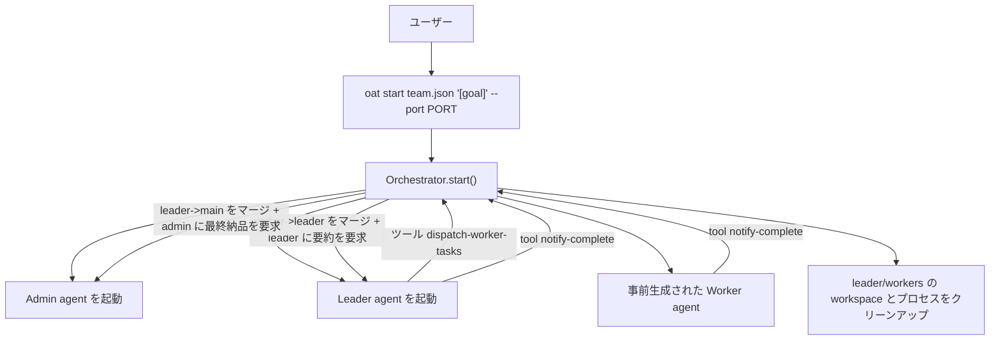

# エージェントチームのアーキテクチャ（Orchestrator + pi-coding-agent）

## 1. 概要：宣言的チームがどう実現されるか

このプロジェクトは「宣言的な agent チーム」ワークフローを提供します。`team.json` 内で `Admin / Leader / Worker` のロール、モデル、skills、そしてチームごとのブランチ/ワークスペース戦略を宣言します。実行時には Orchestrator が設定を読み取り、以下を行います：

- `Admin`、各チームの `Leader`、および `Worker` プールを事前生成して起動（leader が完了しクリーンアップをトリガーするまで動作）
- `Leader` が `dispatch-worker-tasks` ツール経由で事前生成された `Worker` にタスクを分配する
- `Worker` は git の worktree による独立した workspace 内で作業し、具体的な変更を行い `CHANGELOG.md` を生成する
- Orchestrator は `Worker` のブランチを対応する `Leader` ブランチへマージし、`Leader` に各 worker の CHANGELOG を集約させる
- `Leader` の最終集約が終わったら Orchestrator は `project.base_branch` へマージし、`Admin` に最終的な納品サマリーとレポートを生成させる

関係性は次のように理解できます：

- `Admin`：プロジェクトマネージャ（最終集約・納品）
- `Leader`：チームリード（タスク分解、worker スケジューリング、結果集約）
- `Worker`：エンジニア（タスク実行、変更の提出、CHANGELOG 執筆）

## 2. コンポーネント分解（コードモジュールの責務）

### Orchestrator（オーケストレーションの入口）

Orchestrator は `src/orchestrator/orchestrator.ts` にあり、主に以下を担当します：

- `ResolvedConfig` から各 agent の `workspacePath`、ポート、モデル、skills を計算する
- `Admin` と全ての `Leader` を注入し起動する
- Orchestrator の HTTP ツールルートを登録する（pi-coding-agent 側のツールからコールバックできるようにする）
- `workspace-inject` を通じて、各 workspace に pi-coding-agent が必要とする「agent markdown / tools / plugins / meta 情報」を書き込む

起動時に Orchestrator が行う主な処理：

1. `Admin` と `Leader`（静的 agent）を生成して起動する
2. HTTP サーバを起動し、ツールのコールバックを待機する（worker の生成/マージ/レポートはこれらのエンドポイントで処理）

### TaskManager（動的スケジューリングとマージのリポート）

動的な部分は `src/orchestrator/task-manager.ts` が担当します。主な責務：

- `Leader` の要求を受ける：`dispatch-worker-tasks`
- 起動時に各タスクに対して `Worker` を作成する（worktree workspace + `npx skills` での skill インストール + runtime 起動）
- 完了通知を受ける：`POST /tool/notify_complete`
- git のマージを実行する：
  - `Worker` ブランチ -> `Leader` ブランチ
  - `Leader` ブランチ -> `project.base_branch`
- CHANGELOG を根拠に `Leader`/`Admin` に集約を促す
- クリーンアップ（runtime 停止 + workspace 削除）

### RuntimeProvider（pi AgentSession の管理方法）

デフォルトの実装は `local_process` で、`src/sandbox/local-process.ts` の `PiSessionProvider` が担います：

- 各 agent ごとに `createAgentSession()` でインプロセス pi AgentSession を作成する（独立 OS プロセスなし）
- `workspacePath` を cwd とし、systemPrompt と `defineTool` カスタムツールを注入する
- `stop` は `session.dispose()` を呼び出してセッションを解放する

> 拡張ポイント：`RuntimeModeEnum` は enum として存在しますが、現状は `local_process` に注力しています。

### WorkspaceProvider（workspace 隔離と git worktree 管理）

workspace 戦略は `src/workspace/workspace-provider.ts` の factory によって提供され、デフォルトは `WorktreeWorkspaceProvider` です：

- agent/ブランチごとに git の worktree workspace を作成する（`<workspace.root_dir>/<spec.id>` のようなディレクトリ）
- 大規模リポジトリのフットプリント削減のため `sparse-checkout` を使う（パスは `team.leader.repos` で許可リストとして渡す）
- 必要に応じて `git lfs pull` を実行する
- workspace ディレクトリが存在するが git worktree 参照が壊れている場合（前回の cleanup で削除された等）、自動検出して worktree を再作成
- クリーンアップは `git worktree remove --force` とディレクトリ削除で行う

> 拡張ポイント：`workspace.provider` は現状 `worktree` のみ実装されています。`shared_clone/full_clone` は factory 内でプレースホルダです。

### SkillResolver（`npx skills` で skills を workspace にインストール）

`src/skills/skill-resolver.ts` で実装：

- 各 `SkillEntry` に対して `npx skills add <source> --skill <name> -a openclaw --copy -y` を実行（`cwd` = workspace）
- Skills は `<workspacePath>/skills/` にインストール
- pi-coding-agent の `DefaultResourceLoader` が発見できるよう `.pi/skills` → `skills` シンボリックリンクを作成

### Git + ドキュメントの流れ：MergeManager / ChangelogManager / GitIdentity

- `src/git/merge-manager.ts`：`merge --no-ff` を実行し、`worker->leader` と `leader->main` を担当
- `src/changelog/changelog-manager.ts`：workspace ルートの `CHANGELOG.md` を読み取る
- `src/git/git-identity.ts`：各 agent workspace に `--local` レベルの git アイデンティティ（`user.name` / `user.email`）を設定し、`notify-complete` 時に `git add -A && git commit` を自動実行

#### Git アイデンティティルール

| 役割 | `user.name` フォーマット | `user.email` フォーマット |
|------|-------------------|--------------------|
| Admin | `{projectName}-{adminName}` | `admin@project-{projectName}.oat` |
| Leader | `{teamName}-leader-{leaderName}` | `leader-{teamName}@project-{projectName}.oat` |
| Worker | `{teamName}-worker-{index}` | `worker-{index}-{teamName}@project-{projectName}.oat` |

アイデンティティは `oat start` 時に `git config --local` で設定され、workspace ディレクトリ内のみ有効。再起動時に自動上書き。

## 3. 実行フロー（起動から納品まで）

全体の「メインフロー」は以下です：



### 3.1 起動フェーズ：Admin + Leader の注入

Orchestrator は各静的 agent を次のようにセットアップします：

- workspace 作成（worktree provider）
- `npx skills add` で skills をインストールし `.oat/* meta` を書き込む（`src/pi/workspace-inject.ts` 経由）
- `defineTool` 編成ツールの構築（TaskManager へのクロージャ）
- `createAgentSession({ cwd, customTools, systemPrompt })` で pi AgentSession を作成

注入の中心は `src/pi/workspace-inject.ts`：

- `writeAgentWorkspaceConfig()`：`.oat/scope.json`、`.oat/orchestrator.json`、`.oat/agent.json` を書き込む
- `buildAgentSystemPrompt()`：AgentSession に注入するシステムプロンプトを構築する

### 3.2 Worker へのタスク分配：Leader が tasks をディスパッチ

`Leader` は `dispatch-worker-tasks` ツールを呼び、次のようなペイロードを送ります：

```json
{ "tasks": [ { "index": 0, "prompt": "..." }, { "index": 1, "prompt": "..." } ] }
```

Orchestrator は `TaskManager.dispatchWorkerTasks()` 内で処理します：

- `tasks.length` を worker 数とする
- 各 task について割り当て：
  - `workerId = <team.name>-worker-<index>`
  - `branch = <team.branch_prefix>/worker-<index>`
  - `port = allocatePort()`（runtime の次に空いているポートに基づく）
  - `workspacePath = <workspace.root_dir>/<workerId>`
- worker workspace を作成：`workspaceProvider.ensureWorkspace(spec, team.leader.repos)`
- `npx skills add` で skills をインストール：
  - worker skills = `leader.skills` + `team.worker.extra_skills`
- `.oat/*` meta を書き込み、システムプロンプトと worker 専用ツール（`notify-complete`、`report-progress`、`generate-changelog`）を構築
- `createAgentSession()` でインプロセス pi AgentSession を作成（独立 OS プロセスなし）
- **全 worker に並行して** prompt を送信（fire-and-forget）；worker は `notify-complete` ツールで完了を報告
- worker が前のタスクを完了済みの場合、再ディスパッチ前に `resetSession` を呼んで会話履歴をクリアする

### 3.3 マージとレポート：worker->leader->admin

`Worker` が `POST /tool/notify_complete` を呼ぶと：

1. `TaskManager.handleWorkerComplete()`：
   - 受け取った `changelog` を読み込む/利用（渡されていなければ worker workspace の `CHANGELOG.md` を読む）
   - **`git add -A && git commit` を自動実行**（commit message: `feat({teamName}): worker-{index} task complete`）
   - git マージを実行：`worker.spec.branch -> leader.spec.branch`
   - leader の session を使って、worker の CHANGELOG を leader 自身の CHANGELOG に集約するよう促す

2. `Leader` が最終的に `notify-complete` を呼ぶと：
   - **`git add -A && git commit` を自動実行**（commit message: `feat({teamName}): leader task complete`）
   - `TaskManager.handleLeaderComplete()` が git マージを実行：`leader.spec.branch -> project.base_branch`
   - leader の `CHANGELOG.md` を読み取る（または notify-complete で渡された changelog を利用）
   - admin の session で最終サマリーを作成させ、チームの CHANGELOG を含める
   - leader とその worker のプロセスと workspace をクリーンアップ（stop + remove）

## 4. Workspace の隔離と git 戦略

### 4.1 worktree のレイアウト

デフォルトの workspace provider は `worktree` です。workspace ディレクトリは次の配下に作成されます：

- `<workspace.root_dir>/<agentId>`（例：`<team.json のディレクトリ>/workspaces/frontend-worker-0`）

各 agent の workspace は同じ git リポジトリから作られます：

- `config.project.repo` が git リポジトリのルート
- `config.project.repo` が相対パスの場合は `team.json` のディレクトリ基準で解決
- workspace が存在しない場合：
  - 既存ブランチなら `git worktree add <path> <branch>`
  - 存在しないブランチなら `git worktree add <path> -b <branch>`（現在の HEAD から作成）

### 4.2 sparse-checkout と `teams[].leader.repos` の許可リスト

`workspace.sparse_checkout.enabled=true` かつ leader が `leader.repos` を提供している場合：

- worker workspace は次を実行します：
  - `sparse-checkout init --cone`
  - `sparse-checkout set <leader.repos...>`

つまり：

- `leader.repos` は「worker が見たり変更できるパスの allowlist」として機能し、「追加の git リポジトリ」ではありません

### 4.3 LFS 戦略

`workspace.git.lfs=pull` の場合：

- workspace 作成後に `git lfs pull` を実行します

失敗しても warning を記録して Orchestrator を止めずに継続します。

### 4.4 スコープの隔離

`writeAgentWorkspaceConfig()` が各 workspace に `.oat/scope.json` を書き込み、ロールごとにアクセス可能なパスを宣言します：

- Worker：自身の workspace ディレクトリのみ
- Leader：自身の workspace + 全 worker の workspace ディレクトリ
- Admin：自身の workspace + 全 leader および全 worker の workspace ディレクトリ

> 注意：Orchestrator の最終マージはローカルの `git merge`（`MergeManager` 経由）に依存し、先に worker にリモートへ push させることを強制していません。

## 5. Orchestrator ツール API（pi-coding-agent から呼び出す）

Orchestrator 起動後、`--port <PORT>`（CLI で指定）を listen し、次のツールルートを登録します：

- `POST /tool/dispatch_worker_tasks`
  - 用途：事前生成された worker にタスクプロンプトを送信
  - 入力：`{ "leaderId": "<leaderId>", "tasks": [{ "index": 0, "prompt": "..." }] }`
- `POST /tool/notify_complete`
  - 用途：agent が作業完了を通知（Orchestrator が merge と要約を行う）
  - 入力：`{ "agentRole": "worker|leader|admin", "agentId": "<id>", "changelog"?: "<string>" }`
- `POST /tool/report_progress`
  - 用途：プレースホルダ実装（現在は ok を返す）
- `POST /tool/generate_changelog`
  - 用途：`agentId` で workspace の `CHANGELOG.md` を読み取る

## 6. 設定の駆動ポイントと主なデフォルト値

動作は主にこれらの `team.json` フィールドに結び付いています：

- ロールと prompt：
  - `admin.prompt`, `teams[].leader.prompt`, `teams[].worker.prompt`
  - prompt は `*.md` のファイルパスにすることができ、loader が内容を読み取り置換する
- モデル：
  - トップレベル `model` は全体のデフォルトモデルとして使われる
  - モデル継承チェーン：`worker.model -> leader.model -> admin.model -> model`
  - `models` は最終的に選ばれたモデル値の alias マッピングに使われる（例：`default -> anthropic/...`）
  - トップレベル `providers` はグローバルな接続設定（`pi AgentSession` への base_url/key 環境変数注入）を提供する
  - モデル文字列に `/` が含まれない場合、provider は `anthropic` がデフォルトになる
- Workspace：
  - `workspace.root_dir` が worktree の作成場所になる
  - `teams[].leader.repos` が sparse-checkout の paths を決める
- マージターゲット：
  - `project.base_branch` が Leader 完了後のマージ先を決める；指定できるのは `main` または `master` のみ

## 7. 現在の実装上の境界と拡張ポイント

実装を超える約束を避けるため、現時点の境界は次の通りです：

- `runtime.mode`：現在は `local_process` のみ実装済み
- `workspace.provider`：現在は `worktree` のみ実装済みで、他戦略は未実装
- `team.worker.total`：worker プールサイズ。team 起動時に事前作成。leader がタスクを完了すると、対応する leader + worker のセッション/workspace は自動的にクリーンアップされます
- `team.worker.skill_sync`：デフォルト値はあるが、現状の実装はこの項目には分岐していない；セッション隔離は `resetSession` によって再ディスパッチ前に会話履歴をクリアすることで実現
