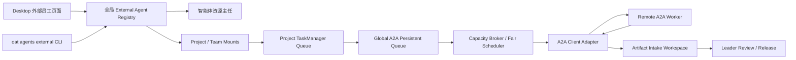

# A2A 外部 Worker、多项目挂载与全局任务队列设计

> 状态：设计已确认，待后续实现。
>
> 本文是 A2A 外部 Agent 注册、项目挂载、调度、交付、UI、CLI、资源主任同步和验收的实现依据。当前版本只持久化方案，不表示仓库已经提供这些能力。

## 1. 目标

为 OAT 增加 A2A 兼容的外部 Agent 支持：

1. 用户可以通过 Desktop 页面或 CLI 注册外部 A2A Agent。
2. 外部 Agent 是全局资源，一次注册后可以挂载到多个 Project。
3. Project 挂载必须关联具体 Team，由对应 Leader 调度。
4. 外部 Agent 功能角色固定为 Worker，永远不能成为 Admin 或 Leader。
5. 系统区分正式员工和外包员工，工牌颜色、文字和图标均不同。
6. 智能体资源主任能够获知注册、挂载、健康、容量和占用变化。
7. A2A 并发遵循任务队列机制：项目内保留现有任务队列，全局增加跨 Project 的 A2A 持久化公平队列。
8. 外部代码交付必须经过 Artifact Intake 和 Leader Review，不能绕过现有 Git/release 流程。
9. 所有新增 OAT 工具遵循统一的 `oat-` 前缀规范。

## 2. 协议基线与术语

首期以 A2A Protocol 1.0 为基线：

- 规范：<https://a2a-protocol.org/latest/specification/>
- Agent Discovery：<https://github.com/a2aproject/A2A/blob/main/docs/topics/agent-discovery.md>
- 官方 TypeScript SDK：<https://github.com/a2aproject/a2a-js>

首期支持 HTTP+JSON/REST 和 JSON-RPC；gRPC 作为后续能力。v0.3 兼容必须按 Agent 显式开启，不允许静默降级。

术语：

- **A2A Client**：OAT 的外部 Worker适配器。
- **A2A Server / Remote Agent**：用户注册的远端外部 Agent。
- **Agent Card**：远端 Agent 的身份、接口、协议版本、鉴权、skills 和 capability 描述。
- **External Agent**：全局注册的外部员工实体。
- **Project Mount**：External Agent 与某个 Project/Team 的授权关系。
- **A2A Queue Item**：OAT 全局队列中等待或正在远端执行的任务。
- **Artifact Intake**：接收、校验并导入外部 Agent 交付物的隔离流程。

## 3. 总体架构



关键决策：

- 外部 Agent 不伪装成 `AgentInstanceSpec`，不进入本地 PiSession/Docker Worker pool。
- Project TaskManager 管理业务任务树、Leader waiting、review 和 release。
- Global A2A Queue 管理多 Project 公平排队、外部 Agent 全局并发、A2A 网络交互和恢复。
- 外部 Agent自己的服务端队列只是远端内部实现，不能代替 OAT 的全局队列。
- A2A `COMPLETED` 只表示远端执行结束，不表示 OAT 已接受交付。

## 4. 人员身份模型

不增加 `external_worker` 角色。角色、用工属性和执行后端是正交维度：

```ts
enum AgentRoleEnum {
  Admin = "admin",
  Leader = "leader",
  Worker = "worker",
}

enum EmploymentClassEnum {
  Internal = "internal",
  Contractor = "contractor",
}

enum AgentExecutionBackendEnum {
  ManagedPi = "managed_pi",
  ExternalA2A = "external_a2a",
}
```

| 人员 | role | employmentClass | executionBackend |
| --- | --- | --- | --- |
| OAT Admin | admin | internal | managed_pi |
| OAT Leader | leader | internal | managed_pi |
| 本地 Worker | worker | internal | managed_pi |
| A2A 外部 Agent | worker | contractor | external_a2a |

注册与挂载校验必须将外部 Agent 的 role 固定为 `worker`，任何 Admin/Leader 声明都应拒绝或忽略，不能让 Agent Card 自行提升权限。

新增统一资源视图，不扩展要求 workspace/branch/model 的本地 `AgentInstanceSpec`：

```ts
interface WorkerResourceDescriptor {
  resourceId: string;
  role: "worker";
  employmentClass: "internal" | "contractor";
  executionBackend: "managed_pi" | "external_a2a";
  displayName: string;
  teamName: string;
  capabilities: WorkerCapability[];
  health: WorkerHealthStatus;
  capacity: {
    maximum: number;
    active: number;
    queued: number;
  };
  externalAgentId?: string;
  mountId?: string;
  localAgentId?: string;
}
```

## 5. 全局注册表与持久化

建议使用 SQLite：

```text
~/.oat/a2a/registry.sqlite
```

凭据不存入 registry；registry 只保存 credential reference。

主要表：

```text
external_agents
external_agent_cards
external_agent_mounts
external_agent_queue_items
external_agent_capacity_leases
external_agent_health
external_agent_audit_events
resource_inventory_events
```

采用 WAL、schema version 和事务迁移。Desktop、CLI 和 Project Orchestrator 通过同一服务模块访问，禁止各自实现一套 JSON 文件读写。

### 5.1 ExternalAgent

```ts
interface ExternalAgent {
  id: string;                       // ext-uuid
  displayName: string;
  role: "worker";
  employmentClass: "contractor";
  protocol: "a2a";
  cardUrl: string;
  selectedInterface: {
    url: string;
    protocolBinding: "HTTP+JSON" | "JSONRPC" | "GRPC";
    protocolVersion: string;
    tenant?: string;
  };
  agentCard: SanitizedAgentCard;
  agentCardDigest: string;
  etag?: string;
  credentialRef?: string;
  supportedSkills: ExternalAgentSkill[];
  capabilities: {
    streaming: boolean;
    pushNotifications: boolean;
    extendedAgentCard: boolean;
    oatWorkerDelivery: boolean;
  };
  maximumConcurrency: number;
  status: "active" | "degraded" | "quarantined" | "disabled";
  health: "unknown" | "healthy" | "unreachable" |
          "auth_error" | "protocol_error" | "card_changed";
  trustPolicy: {
    requireHttps: boolean;
    requireSignedCard: boolean;
    allowedOrigins: string[];
    allowPrivateNetwork: boolean;
    allowLegacyV03: boolean;
  };
  createdAt: string;
  updatedAt: string;
  lastCardRefreshAt?: string;
  lastHealthCheckAt?: string;
}
```

### 5.2 ProjectAgentMount

一次 mount 对应一个 Project/Team。同一个 External Agent 可以有多个 mount：

```ts
interface ProjectAgentMount {
  id: string;                     // mount-uuid
  externalAgentId: string;
  projectName: string;
  teamName: string;
  enabled: boolean;
  status: "active" | "draining" | "detached";

  selectionMode: "explicit_only" | "eligible_auto";
  allowedSkillIds: string[];

  dataPolicy: {
    maximumClassification: "public" | "internal" | "confidential";
    allowSourceCode: boolean;
    allowFileParts: boolean;
    allowExternalUrls: boolean;
    maximumInputBytes: number;
    maximumArtifactBytes: number;
  };

  deliveryProfile: "advisory" | "oat_patch_v1";
  maximumActiveTasks?: number;
  maximumQueuedTasks?: number;
  capacityWeight: number;
  dailyTaskLimit?: number;
  taskTimeoutSeconds: number;
  priority: number;
  createdAt: string;
  updatedAt: string;
}
```

安全默认值：

```text
selectionMode = explicit_only
maximumClassification = public
allowSourceCode = false
deliveryProfile = advisory
capacityWeight = 1
```

刚挂载的外部员工不会自动收到任务或源码。

## 6. 页面注册流程

在全局“智能体资源”中增加“外部员工”页面，不放入单个 Project 的普通 Worker 数量配置。

注册向导：

1. 输入 Agent Card URL。
2. 选择或创建 credential reference。
3. 获取并校验 Agent Card。
4. 展示 provider、skills、协议版本、transport、输入输出模式和 required extensions。
5. 展示 HTTPS、签名、endpoint、私网访问和认证状态。
6. 执行无副作用连接测试。
7. 用户确认信任和最大并发。
8. 写入全局 registry。
9. 选择挂载的 Project 和 Team。
10. 配置 selection、data policy、delivery profile 和队列额度。
11. 发布资源变更事件，通知资源主任和运行中的 Project Orchestrator。

Agent Card description、examples、documentation URL 都是外部不可信数据：页面必须转义；向资源主任提供时必须长度限制和结构化标记，不能原样拼入系统提示词。

## 7. CLI 设计

```bash
oat agents external register \
  --card-url https://agents.example.com/.well-known/agent-card.json \
  --credential-ref keychain:oat/a2a/vendor-a \
  --require-signature

oat agents external list
oat agents external show <external-agent-id>
oat agents external test <external-agent-id>
oat agents external refresh <external-agent-id>
oat agents external disable <external-agent-id>
oat agents external enable <external-agent-id>

oat agents external mount <external-agent-id> \
  --project project-a \
  --team backend \
  --selection explicit-only \
  --delivery advisory

oat agents external mounts <external-agent-id>
oat agents external unmount <mount-id>
oat agents external remove <external-agent-id>
```

要求：

- 不推荐或记录明文 `--token`。
- 输出不得打印 credential。
- 非交互 register/mount 需要 `--yes`。
- remove 前必须没有 active mount、queue item 或未完成 remote task。
- unmount 默认先进入 `draining`，完成/取消现有任务后再 detached。
- `--force` 也不能直接遗忘可能仍在远端运行的任务，必须进入 reconcile/cancel 流程。

## 8. Agent Card、版本和网络验证

注册与刷新时执行：

1. 只接受 HTTP(S)，生产环境默认强制 HTTPS。
2. 限制响应大小、连接/读取超时和重定向次数。
3. 每次重定向后重新校验 scheme、origin、DNS 和实际 IP。
4. 默认拒绝 localhost、link-local、metadata endpoint 和私网 IP。
5. 企业私网 Agent 需要显式 `allowPrivateNetwork` 与 allowlist。
6. 防止 DNS rebinding；每次连接验证解析后的目标地址。
7. 严格解析 Agent Card 必填字段和类型。
8. 按 Agent Card 顺序选择第一个 OAT 支持的 interface。
9. 检查 `A2A-Version`；首期要求 1.0，v0.3 仅显式兼容。
10. 存在不支持的 required A2A extension 时拒绝注册。
11. 按策略验证 Agent Card JWS、TLS identity 和 provider identity。
12. 根据 security schemes 解析 out-of-band credential。
13. 支持 extended Agent Card 时，在认证后获取并替换当前认证会话使用的 public card。
14. 保存 ETag、digest 和受信任 identity snapshot。

Agent Card 变化策略：

- 仅增加普通 skill：自动刷新并审计。
- endpoint、provider、security scheme、required extension、signing key 变化：进入 `quarantined`。
- quarantined Agent 不接收新任务，等待用户重新确认。

如果选中的 AgentInterface 声明 `tenant`，每个 A2A 请求必须原样回传该 tenant。不能擅自把 OAT Project ID 当作 tenant；OAT 的项目隔离由 mount/context/credential policy 实现。

## 9. 凭据模型

```ts
interface CredentialStore {
  resolve(ref: string): Promise<A2ACredential>;
  store?(input: A2ACredentialInput): Promise<string>;
  remove?(ref: string): Promise<void>;
}
```

优先支持：

1. OAuth2/OIDC 动态 token。
2. mTLS credential reference。
3. OS keychain。
4. API key reference。
5. 无人值守环境的环境变量引用。

registry 仅保存类似：

```json
{
  "credentialRef": "keychain:oat/a2a/ext-123"
}
```

不得保存或输出 token、refresh token、私钥和明文 API key。

## 10. 资源主任同步

### 10.1 资源清单

`resourceInventory()` 增加：

```json
{
  "workforce": {
    "internal": {
      "total": 12,
      "workers": 8
    },
    "contractors": {
      "registered": 4,
      "healthy": 3,
      "busy": 1,
      "quarantined": 1,
      "mounts": 7,
      "queuedTasks": 5
    }
  },
  "externalAgents": [
    {
      "id": "ext-123",
      "name": "Vendor Code Agent",
      "employmentClass": "contractor",
      "role": "worker",
      "health": "healthy",
      "skills": ["typescript", "testing"],
      "mountedProjects": ["project-a", "project-b"],
      "activeAssignments": 1,
      "queuedAssignments": 2,
      "maximumConcurrency": 2
    }
  ]
}
```

### 10.2 资源变更事件

```ts
interface ResourceInventoryEvent {
  id: string;
  type:
    | "external_agent_registered"
    | "external_agent_updated"
    | "external_agent_quarantined"
    | "external_agent_mounted"
    | "external_agent_unmounted"
    | "external_agent_capacity_changed";
  summary: string;
  externalAgentId: string;
  projectName?: string;
  teamName?: string;
  createdAt: string;
}
```

行为：

- Desktop 显示宿主生成的可信系统事件卡片。
- 下一次用户与资源主任对话前，把未读事件以结构化 `RESOURCE_INVENTORY_CHANGE` 注入上下文。
- 不因后台事件让模型自动向用户发消息。
- 资源工具每次读取实时 registry，不依赖旧会话缓存。

### 10.3 资源主任工具

按照 OAT 工具统一前缀方案：

| 功能 | 工具 |
| --- | --- |
| 项目资源清单 | `oat-list-project-resources` |
| 创建项目配置提案 | `oat-draft-project-configuration` |
| 外部员工清单 | `oat-list-external-agents` |
| 外部员工挂载提案 | `oat-draft-external-agent-mount` |
| 外部员工解绑提案 | `oat-draft-external-agent-unmount` |

资源主任只能读取和提出方案；真正 register/mount/unmount 仍需用户在 UI 中确认，保持现有 hard permissions。

## 11. 两级任务队列

A2A 并发必须参考并复用现有任务队列原则，但由于同一外部 Agent 可以服务多个 Project，不能只使用单 Project 的 `taskQueueByAgent`。

```text
Project TaskManager Queue
    │ 业务任务树、conflict、Leader waiting、review/release
    ▼
Global A2A Persistent Queue
    │ 多 Project 公平性、全局容量、健康、网络、恢复
    ▼
Remote Agent Internal Queue
```

职责：

### Project TaskManager

- Admin → Leader → Worker 父子任务关系。
- Project 内 conflictKey。
- Leader waiting。
- 任务看板与 delivery report。
- ReviewRequest、integration 和 release。

### Global A2A Queue

- 多 Project/mount 排队与公平调度。
- External Agent 全局并发。
- A2A Message 提交、remote task/context ID。
- streaming/polling、cancel、continue、reconcile。
- Artifact 接收状态。
- Project Orchestrator 崩溃后的恢复。

Project TaskManager决定“是否交给外包员工”，Global A2A Queue决定“何时、以多少并发、按什么公平策略发送”。

## 12. 全局 A2A Queue Item

```ts
interface ExternalAgentQueueItem {
  id: string;

  externalAgentId: string;
  mountId: string;
  projectName: string;
  teamName: string;
  oatTaskId: string;
  leaderId: string;

  priority: "low" | "normal" | "high";
  conflictKey?: string;
  conflictScope?: "project" | "mount" | "external_agent" | "global";

  status:
    | "queued"
    | "reserved"
    | "submitting"
    | "submission_unknown"
    | "submitted"
    | "working"
    | "input_required"
    | "auth_required"
    | "cancel_requested"
    | "reconciling"
    | "artifact_intake"
    | "completed"
    | "failed"
    | "rejected"
    | "canceled";

  messageId: string;
  remoteTaskId?: string;
  contextId?: string;
  attempt: number;

  queuedAt: string;
  reservedAt?: string;
  submittedAt?: string;
  startedAt?: string;
  terminalAt?: string;
  ownerProcessId?: string;
  heartbeatAt?: string;

  dataPolicySnapshot: DataPolicy;
  capabilitySnapshot: CapabilitySnapshot;
  artifactIds?: string[];
}
```

`QueuedTask` 增加关联快照：

```ts
interface QueuedTask {
  targetResource?: {
    resourceId: string;
    role: "worker";
    employmentClass: "internal" | "contractor";
    executionBackend: "managed_pi" | "external_a2a";
    externalAgentId?: string;
    mountId?: string;
  };

  remoteExecution?: {
    protocol: "a2a";
    queueItemId: string;
    messageId: string;
    remoteTaskId?: string;
    contextId?: string;
    attempt: number;
    state: string;
    lastEventAt?: string;
    artifactIds?: string[];
  };
}
```

Project snapshot 与 global queue 通过 `queueItemId/oatTaskId` 双向关联，状态同步必须幂等。

## 13. 入队和调度流程

1. Leader 调用 `oat-dispatch-worker-tasks`。
2. Project TaskManager 创建并持久化本地 `QueuedTask`。
3. 校验 mount、skill、health、data policy、delivery profile、队列额度。
4. 向 Global A2A Queue 插入 `queued` item。
5. Leader workflow 转为 `waiting`。
6. Fair Scheduler 发现外部 Agent 有可用容量。
7. SQLite transaction 原子地把 queue item 从 `queued` 更新为 `reserved` 并占用 capacity slot。
8. Dispatcher 发送 A2A Message。
9. 收到 remote task/context ID 后更新为 `submitted`。
10. A2A Task 更新为 working/input-required/completed 等状态。
11. completed 后进入 `artifact_intake`，校验交付物。
12. Intake 成功后创建 delivery report 或 ReviewRequest。
13. 确认 terminal 后释放 capacity slot，调度下一项。

加入 A2A 队列即代表 OAT 接受任务；不能等远端空闲后才创建本地任务。

## 14. 容量与租约

`ExternalAgent.maximumConcurrency` 是全局上限。以下状态全部占用槽位：

```text
reserved
submitting
submission_unknown
submitted
working
input_required
auth_required
cancel_requested
reconciling
artifact_intake
```

原因：这些任务可能仍在远端存在或恢复，提前释放会造成实际并发超过上限。

约束：

```text
Agent active <= ExternalAgent.maximumConcurrency
Mount active <= mount.maximumActiveTasks
Mount queued <= mount.maximumQueuedTasks
Project daily tasks <= mount.dailyTaskLimit
```

capacity lease 只用于声明“哪个 dispatcher 正在推进该 queue item”，不是并发模型本身。

规则：

- reserve 使用数据库事务。
- 获得 remote task ID 后不能因本地 heartbeat 过期直接释放槽位。
- owner 崩溃后由恢复进程先 GetTask/reconcile。
- 未确认 remote terminal/cancel 前保持占用。

## 15. 公平调度

不能使用所有 Project 共用的严格 FIFO，否则一个 Project 可以长期占满外部 Agent。

推荐：

- 每个 mount 内部 FIFO。
- 不同 Project/mount 之间使用 weighted round-robin 或 deficit round-robin。
- `capacityWeight` 默认 1。
- priority 允许有限插队，但普通任务通过 aging 防止饥饿。
- disabled/quarantined/draining mount 不接新任务。
- health degraded 时降低权重；unreachable/auth_error 时暂停下发。

示例，Agent 并发为 3：

```text
Project A / Backend: A1 A2 A3 A4
Project B / Platform: B1 B2
Project C / QA: C1

第一批：A1、B1、C1
后续：A2、B2、A3、A4
```

而不是让 A 的全部任务永远先于 B/C。

## 16. conflictKey

增加 scope：

```ts
interface ExternalConflictPolicy {
  key: string;
  scope: "project" | "mount" | "external_agent" | "global";
}
```

默认 `project`：

- `project`：同 Project 内互斥。
- `mount`：同一个挂载关系互斥。
- `external_agent`：该外部 Agent 的所有 Project 任务互斥。
- `global`：跨全部资源互斥，仅系统策略或管理员可创建。

不能让普通用户可控 key 任意创建 global lock，避免跨项目拒绝服务。

## 17. Worker 目录和执行 Provider

```ts
interface WorkerDirectory {
  listForTeam(
    projectName: string,
    teamName: string,
  ): Promise<WorkerResourceDescriptor[]>;
}

interface WorkerExecutionProvider {
  backend: "managed_pi" | "external_a2a";
  enqueue(assignment: WorkerAssignment): Promise<DispatchReceipt>;
  cancel(assignment: WorkerAssignment): Promise<void>;
  reconcile(assignment: WorkerAssignment): Promise<AssignmentStatus>;
}
```

实现：

```text
ManagedPiWorkerProvider
A2AWorkerProvider
```

外部 Provider 的 enqueue 只写入全局队列，不在 Leader 工具调用内等待远端执行。

## 18. Leader 调度工具

扩展 `oat-dispatch-worker-tasks`：

```json
{
  "tasks": [
    {
      "prompt": "分析支付失败日志并提出修复方案",
      "independent": true,
      "target": {
        "type": "external",
        "mountId": "mount-123"
      },
      "requiredSkills": ["incident-analysis"]
    }
  ]
}
```

正式 Worker：

```json
{
  "target": {
    "type": "internal",
    "index": 0
  }
}
```

省略 target：

- 默认只在正式 Worker 中选择。
- 只有 `eligible_auto` mount 才进入自动候选。
- 必须满足 skill、health、容量、data policy 和 delivery profile。
- 源码任务只能选择 `allowSourceCode=true + oat_patch_v1`。

Leader prompt 显示正式/外包 Worker目录、状态和授权范围。

新增 Leader 工具：

```text
oat-get-external-task
oat-continue-external-task
oat-cancel-external-task
```

所有工具必须遵循 `oat-` 保留命名空间，不保留无前缀别名。

## 19. A2A Task 状态映射

| A2A 状态 | OAT 主状态 | 行为 |
| --- | --- | --- |
| SUBMITTED | running | 保存 remote task/context ID |
| WORKING | running | 更新远端进度 |
| INPUT_REQUIRED | waiting | 通知 Leader，等待 `oat-continue-external-task` |
| AUTH_REQUIRED | waiting | mount/Agent 标记 auth_error，等待处理 |
| COMPLETED | review_pending 或 intake | 先验证 Artifact，不直接完成代码任务 |
| FAILED | failed | 保存受控错误摘要 |
| REJECTED | failed | 通知 Leader 决定替换 Worker |
| CANCELED | cancelled | 确认 terminal 后释放容量 |
| 直接 Message | completed/review_pending | 仅 advisory 可直接作为结果 |

不一定需要扩展顶层 `QueuedTaskStatusEnum`；页面可以在主状态旁展示 `remoteExecution.state`，避免破坏现有任务状态机。

## 20. A2A 更新、恢复和幂等

推荐：

1. `SendMessage` 使用 return-immediately 获取 Task。
2. 持久化 remote task/context ID。
3. 支持 subscribe/streaming 时获取实时事件。
4. streaming 断开后使用 GetTask 恢复。
5. 不支持 streaming 时轮询。
6. Push Notification 作为后续公开 gateway 能力。

当前 Orchestrator 只监听 localhost，首期不能依赖远端 webhook 回调。

幂等规则：

- messageId 在同一逻辑提交/重试中保持稳定。
- A2A SendMessage 不保证所有服务端幂等。
- 网络超时且未得到 remote task ID 时进入 `submission_unknown`。
- `submission_unknown` 保持容量占用，不立即换 messageId 重发。
- 优先通过 ListTasks、GetTask、correlation extension 或人工对账。
- Cancel 虽为幂等操作，也必须保存请求和最终状态。

失败策略：

- 发送前暂时失败：保留 queued，指数退避，不增加 attempt。
- 远端明确 rejected/failed：终止本次 item，通知 Leader。
- Project Orchestrator 崩溃：恢复后按 remoteTaskId GetTask。
- 没有 remoteTaskId 的 submitting：转 submission_unknown，禁止盲目重发。

## 21. OAT Worker Delivery Extension

普通 A2A Agent 只保证标准 Message/Artifact 交互，不能自动满足 OAT 的 Git review 约束。定义：

```text
https://open-agent-team.dev/a2a/extensions/worker-delivery/v1
```

能力档位：

| profile | 要求 | 可接任务 |
| --- | --- | --- |
| advisory | 标准 A2A 1.0 | 分析、研究、文档、建议 |
| oat_patch_v1 | 支持 worker-delivery extension | 代码修改任务 |

任务 metadata：

```json
{
  "extensions": [
    "https://open-agent-team.dev/a2a/extensions/worker-delivery/v1"
  ],
  "metadata": {
    "oat": {
      "taskId": "task-project-...",
      "projectRef": "opaque-project-ref",
      "team": "backend",
      "baseSha": "abc123",
      "attempt": 1,
      "deliveryProfile": "oat_patch_v1"
    }
  }
}
```

输出 Artifact：

```text
application/vnd.oat.worker-result+json
text/x-diff
application/vnd.oat.test-evidence+json
```

Result manifest：

```json
{
  "status": "ready_for_review",
  "summary": "修复支付重试竞态",
  "baseSha": "abc123",
  "patchArtifactId": "patch-1",
  "changedFiles": ["src/payment/retry.ts"],
  "tests": [
    {
      "command": "pnpm test payment",
      "status": "passed",
      "evidenceArtifactId": "test-1"
    }
  ]
}
```

## 22. Artifact Intake 与 Git 交付

默认不向外部 Agent 提供 Git remote 写权限。

代码任务流程：

1. 固定 base SHA。
2. 根据 data policy 生成最小源码包或短期只读 URL。
3. 外部 Agent 返回 patch 和 test evidence。
4. 下载到隔离 intake 目录。
5. 校验 content type、大小、digest、压缩深度和文件数量。
6. 禁止绝对路径、`..`、`.git`、symlink、device、socket。
7. 对 Artifact URL 执行 SSRF/origin allowlist。
8. 在 OAT-owned 临时 worktree dry-run apply。
9. 校验改动未越过允许路径和 base SHA。
10. 生成本地提交和 GitTaskArtifact。
11. 创建标准 ReviewRequest。
12. Leader 继续使用 review/integration/release 流程。

advisory Artifact 则转换为 TaskDeliveryReport，由 Leader 判断是否需要派发正式实现任务。

## 23. UI 与工牌

颜色不能是唯一区分方式：

| 类型 | 工牌颜色 | 文本 | 视觉 |
| --- | --- | --- | --- |
| 正式员工 | 深蓝 | `正式` | 实心工牌 |
| 外包员工 | 紫色 | `外包 · A2A` | 链接图标或虚线边框 |

状态色独立：绿色健康/空闲、琥珀忙碌、红色失败、灰色离线。

项目树：

```text
Backend Leader
├── backend-worker-0       [正式]
├── backend-worker-1       [正式]
└── Vendor Code Agent      [外包 · A2A]
```

同一外部 Agent 在不同 Project 下显示对应 mount，但详情页指向同一个全局员工，并列出全部挂载。

外部员工详情展示：

- Agent Card identity/provider/version。
- transport 和 A2A 版本。
- skills 和 delivery profile。
- 签名、TLS、credential 状态。
- health、active/maximum concurrency、queued count。
- 全部 Project/Team mounts。
- data policy、成功率、平均时长、最近错误。
- Agent Card digest 和最近刷新时间。

队列展示：

```text
Vendor Code Agent [外包 · A2A]

执行中 2 / 3
├── Project A · Backend · task-A1
└── Project B · Platform · task-B1

排队中 3
├── Project C · QA · task-C1
├── Project A · Backend · task-A2
└── Project B · Platform · task-B2
```

任务卡显示 OAT task ID、external agent/mount、A2A task/context ID、远端状态、队列位置、Artifact 和数据等级。

## 24. 安全边界

必须覆盖：

- Agent Card URL 和 Artifact URL SSRF。
- DNS rebinding、redirect 和 metadata endpoint。
- TLS、JWS、OAuth/API key/mTLS。
- Agent Card drift 和 required extension。
- 多 Project context/credential 隔离。
- 外部 description/artifact 的 prompt injection。
- Artifact 路径穿越、压缩炸弹、恶意 patch。
- 远端重复执行和 ambiguous submission。
- queue starvation、跨 Project 容量竞争。
- 日志、观测和错误中的凭据/源码泄漏。

规则：

- 每个 Project/Team/mount 使用独立 A2A context，不跨 Project 复用。
- tenant 只按 AgentInterface 声明回传。
- remote ListTasks 结果不能默认归属于当前 Project。
- quarantined/disabled Agent 不接收新任务。
- unmount 先 draining。
- 外部输出进入 Leader/资源主任 prompt 前做长度限制和不可信边界标记。
- 外部 Agent 不能获取 OAT 工具调用权限或宿主 Git 凭据。

## 25. 可观测性

```text
a2a.agent.registered
a2a.agent.card_refreshed
a2a.agent.card_changed
a2a.agent.quarantined
a2a.agent.health_changed

a2a.mount.created
a2a.mount.draining
a2a.mount.removed

a2a.queue.enqueued
a2a.queue.reserved
a2a.queue.starved
a2a.capacity.reserved
a2a.capacity.released

a2a.task.submitting
a2a.task.submitted
a2a.task.submission_unknown
a2a.task.status_changed
a2a.task.input_required
a2a.task.completed
a2a.task.failed
a2a.task.canceled
a2a.task.reconciled

a2a.artifact.received
a2a.artifact.rejected
a2a.review.created
```

指标：

- Agent/mount/Project 成功率。
- 排队、远端执行、intake 时长。
- 每 Project 外包任务数和并发份额。
- auth/protocol/network 错误率。
- submission_unknown、Artifact 拒绝和 card drift 次数。
- 公平调度等待时间和 starvation 告警。

## 26. 接口

Desktop IPC：

```text
a2a:agents:list
a2a:agents:register
a2a:agents:test
a2a:agents:refresh
a2a:agents:disable
a2a:agents:enable
a2a:agents:remove

a2a:mounts:list
a2a:mounts:create
a2a:mounts:update
a2a:mounts:drain
a2a:mounts:remove
```

Orchestrator 内部 API：

```text
GET  /api/external-workers
GET  /api/external-workers/:mountId
GET  /api/external-tasks/:taskId
POST /api/external-tasks/:taskId/continue
POST /api/external-tasks/:taskId/cancel
POST /api/external-tasks/:taskId/reconcile
```

这些接口保持当前 localhost/trusted Desktop 边界。首期 OAT 是 A2A Client，不对公网提供 A2A Server。

## 27. 预计实现范围

- `src/types/enums.ts`：EmploymentClass、ExecutionBackend。
- `src/types/orchestrator.ts`：外部 task/mount/queue/delivery 类型。
- 新增 `src/a2a/types.ts`。
- 新增 `src/a2a/registry.ts`。
- 新增 `src/a2a/card-validator.ts`。
- 新增 `src/a2a/credential-store.ts`。
- 新增 `src/a2a/client-factory.ts`。
- 新增 `src/a2a/mount-service.ts`。
- 新增 `src/a2a/global-queue.ts`。
- 新增 `src/a2a/fair-scheduler.ts`。
- 新增 `src/a2a/capacity-broker.ts`。
- 新增 `src/a2a/task-adapter.ts`。
- 新增 `src/a2a/artifact-intake.ts`。
- 新增 `src/a2a/resource-events.ts`。
- `src/orchestrator/task-manager.ts`：WorkerDirectory、Provider、queue link、A2A handoff。
- `src/orchestrator/orchestrator.ts`：API 和 `oat-*` 工具。
- `desktop/src/main/resource-supervisor.ts`：inventory、事件和资源提案工具。
- `desktop/src/main/index.ts`：registry/mount IPC。
- `desktop/src/renderer/src/App.tsx`：项目树、工牌、详情和任务队列。
- `desktop/src/shared/*`：共享类型。
- `src/index.ts`：`oat agents external` CLI。
- README、config、architecture、agent-resources 和新 A2A 文档的四语言版本。

## 28. 测试与验收

### 注册与协议

1. 注册合法 A2A 1.0 Agent。
2. 拒绝非法 Agent Card 和不支持的 required extension。
3. v0.3 必须显式开启。
4. HTTPS、redirect、私网、DNS rebinding、metadata endpoint 检查。
5. JWS、extended card、credential 和 card drift。
6. credential 不进入数据库、日志或 UI。

### 身份和挂载

1. 外部 Agent 永远不能成为 Admin/Leader。
2. 同一 Agent 可以挂载多个 Project/Team。
3. 每个 mount 独立 data policy、context、quota 和状态。
4. unmount draining 不丢失已提交任务。
5. 正式/外包工牌具有颜色、文字和图标差异。

### 队列与并发

1. Leader 调用只负责持久化入队，不等待远端完成。
2. 同一 Agent 跨多个 Project 不超过全局 maximumConcurrency。
3. mount active/queued/daily 限制生效。
4. mount 内 FIFO，不同 mount 公平轮询。
5. priority aging 防止普通任务饥饿。
6. submission_unknown/input_required/auth_required/reconciling 均占用槽位。
7. owner 崩溃后先 reconcile，不直接释放 lease。
8. 不依赖远端 Agent 内部队列作为 OAT backpressure。
9. conflict scope 正确且普通请求不能创建 global lock。

### 任务与恢复

1. A2A Task 状态正确映射。
2. INPUT_REQUIRED 可由 Leader 继续。
3. ambiguous timeout 不盲目重复下发。
4. Orchestrator 崩溃后通过 remoteTaskId 恢复。
5. canceled/terminal 后才释放容量。
6. quarantined/offline Agent 不接新任务。

### Artifact 和 Git

1. A2A completed 不直接完成 OAT 代码任务。
2. advisory Artifact 生成 delivery report。
3. 合法 patch 生成标准 ReviewRequest。
4. 路径穿越、symlink、`.git`、超大 Artifact、压缩炸弹被拒绝。
5. base SHA 和路径白名单被强制验证。
6. 外部 Agent 不获得 Git remote 写权限。

### 资源主任、UI 和工具

1. 注册/挂载/隔离事件通知资源主任。
2. inventory 展示正式/外包、健康、active、queued 和 mounts。
3. 外部 Agent Card 文本按不可信数据处理。
4. 页面和 CLI 共用同一注册/验证服务。
5. 所有新增 OAT 工具使用 `oat-` 前缀。

最终验收条件：

> 外部 Agent 是全局“外包 Worker”资源，不是远程 PiSession。它可被多个 Project/Team 挂载，但每个 mount 拥有独立授权、数据策略和上下文；Project TaskManager 管理业务任务树，Global A2A Persistent Queue 统一管理跨 Project 公平排队和全局并发；所有外部交付必须经过 Artifact Intake 与 Leader Review。

## 29. 推荐实施顺序

1. **人员模型和 Registry**：注册、查看、禁用，不参与调度。
2. **页面、CLI、资源主任**：外包工牌、多项目挂载、inventory 和事件。
3. **Global A2A Queue**：持久化队列、公平调度、capacity 和恢复。
4. **Advisory Worker**：标准 Message/Artifact，不接源码任务。
5. **任务继续与取消**：input-required、cancel、reconcile、ambiguous submission。
6. **Worker Delivery v1**：源码包、patch、test evidence 和 Artifact Intake。
7. **Leader Review 接入**：外部 patch 转标准 ReviewRequest。
8. **自动候选调度**：只对 `eligible_auto` mount 开启。
9. **高级能力**：公开 push gateway、OAuth refresh、mTLS、gRPC、v0.3 和多主机 Registry。
