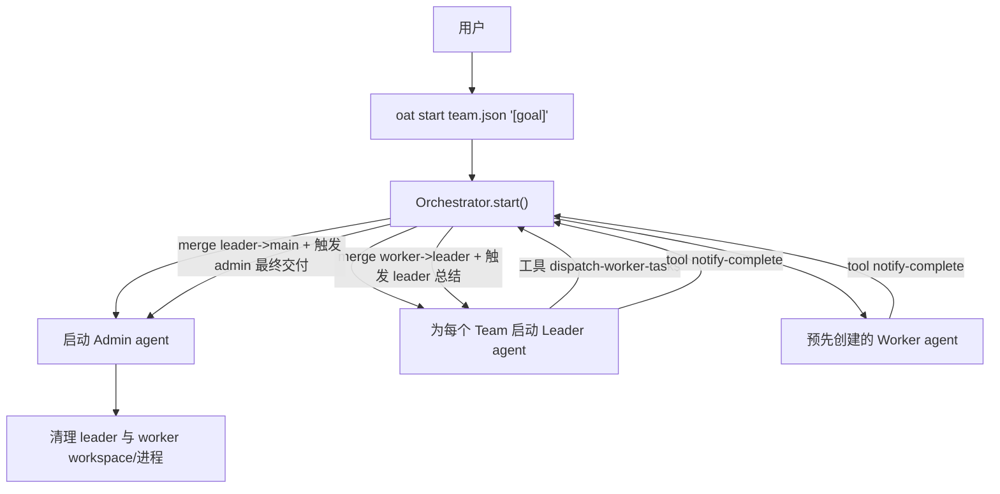

# Agent 团队架构（Orchestrator + pi-coding-agent）

> **协作流程已更新。** 本文中任何描述“Worker 调用 `notify-complete` 后自动合并”或“Leader 自动合并主分支”的段落均为历史实现说明，不再适用。当前正式流程以 [Git 协作与交付流程](./git-collaboration.md) 为准：Worker `submit-review` → Leader review/integration → Admin `approve-release` → MergeController 串行更新 `main/master`。运行工件统一存于 `runtime.persistence.state_dir/git-collaboration/`，不写入 Git worktree。

## 当前 Git 协作架构

```mermaid
flowchart LR
  A[Admin: 项目治理] --> L[Leader: 任务计划与 review]
  L --> W[Worker: task branch + self-test]
  W -->|submit-review| R[持久化 Review Request]
  R -->|review-worker-branch| I[Leader integration branch]
  I -->|submit-release-proposal| P[Release Proposal]
  P -->|approve-release| M[Serialized MergeController]
  M --> G[main / master]
```



任务分支命名为 `oat/<team>/<taskId>/attempt-<n>`，基于创建时锁定的主分支 SHA；Leader 集成分支为 `oat/<team>/<workItem>/integration`。向上汇报使用 artifact manifest 路径、SHA、变更文件和测试证据。

## 1. 总览：声明式团队如何落地

本项目提供一个“声明式的 agent team 构建”流程：你在 `team.json` 中声明 `Admin / Leader / Worker` 的角色、模型、skills、以及团队分支/工作空间策略；运行时由 Orchestrator 读取配置并完成以下工作：

- 启动 `Admin`、每个 `Team` 的 `Leader`，并预先创建 `Worker` 进程池（这些会长期常驻，直到 leader 合并完成后触发清理）
- `Leader` 通过 `dispatch-worker-tasks` 工具向预先创建的 `Worker` 分发任务
- `Worker` 在独立 git worktree workspace 中完成具体变更，并产出 `CHANGELOG.md`
- Orchestrator 将 `Worker` 的分支合并回 `Leader`，并让 `Leader` 汇总 worker 的 CHANGELOG
- `Leader` 汇总完成后再合并进入主分支（`project.base_branch`），并让 `Admin` 做最终交付总结与回报

声明关系可以理解为：

- `Admin`：项目经理（最终汇总与交付）
- `Leader`：团队负责人（拆任务、调度 worker、汇总结果）
- `Worker`：工程师（执行任务、提交变更、撰写 CHANGELOG）

## 2. 组件划分（代码模块职责）

### Orchestrator（编排入口）

Orchestrator 位于 `src/orchestrator/orchestrator.ts`，主要职责是：

- 根据 `ResolvedConfig` 计算各 agent 的 `workspacePath`、模型、skills
- 注入并启动 `Admin`、各 `Leader`
- 注册 Orchestrator 的 HTTP 工具路由（供 pi-coding-agent 工具回调）
- 将 `pi` 需要的“agent markdown、tools、plugins、meta 信息”写入对应 workspace（通过 `workspace-inject` 完成）

Orchestrator 在启动时主要做三件事：

1. 生成并启动 `Admin` 与 `Leader`（静态 agent，pi AgentSession 进程内创建）
2. 预先生成各 Team 的 Worker 进程池（pre-spawn）
3. 开 HTTP 服务（供 Desktop 和外部 REST 调用；pi 工具直接通过 `defineTool` 闭包调用 TaskManager，无需 HTTP 往返）

### TaskManager（动态调度与合并回报）

动态部分由 `src/orchestrator/task-manager.ts` 承担，核心职责：

- 接收 `Leader` 请求：`dispatch-worker-tasks`
- 在启动时为每个任务创建 `Worker`（worktree workspace + 通过 `npx skills` 安装 skills + runtime 启动）
- 接收 `Worker/Leader` 完成通知：`POST /tool/notify_complete`
- 执行 git merge：
  - `Worker` 分支 -> `Leader` 分支
  - `Leader` 分支 -> `project.base_branch`
- 让 `Leader`/`Admin` 基于 CHANGELOG 进行总结
- 清理（stop runtime + remove workspace）

### RuntimeProvider（如何管理 pi AgentSession）

当前默认实现是 `local_process`，由 `src/sandbox/local-process.ts` 的 `PiSessionProvider` 实现：

- 为每个 agent 在进程内通过 `createAgentSession()` 创建 pi AgentSession（无独立系统进程）
- 以 `workspacePath` 作为 cwd，并注入 systemPrompt 和自定义 defineTool 工具
- `stop` 调用 `session.dispose()` 释放对应会话

> 扩展点：`RuntimeModeEnum` 在代码中仅作为枚举存在，但当前实现集中在 `local_process`。

### WorkspaceProvider（工作空间隔离与 git worktree 管理）

当前的 workspace 策略由 `src/workspace/workspace-provider.ts` 工厂提供，默认使用 `WorktreeWorkspaceProvider`：

- 为每个 agent/branch 创建一个 git worktree workspace：目录形如 `<workspace.root_dir>/<spec.id>`
- 使用 `sparse-checkout` 降低大仓库体积（由 `team.leader.repos` 提供允许的路径白名单）
- 可选执行 `git lfs pull`
- 若 workspace 目录已存在但 git worktree 引用失效（如前次运行的 cleanup 已删除），会自动检测并重建 worktree
- 清理时会 `git worktree remove --force` 并删除目录

> 扩展点：`workspace.provider` 目前只落地 `worktree`，`shared_clone/full_clone` 等策略在工厂中仍是占位。

### SkillResolver（通过 `npx skills` 安装 skills 到 workspace）

由 `src/skills/skill-resolver.ts` 实现：

- 对每个 `SkillEntry`，执行 `npx skills add <source> --skill <name> -a openclaw --copy -y`，`cwd` 设为 workspace 路径
- Skills 安装到 `<workspacePath>/skills/`
- 创建 `.pi/skills` → `skills` 符号链接，供 pi-coding-agent 的 `DefaultResourceLoader` 发现和加载

### Git 与文档流水线：MergeManager / ChangelogManager / GitIdentity

- `src/git/merge-manager.ts`：执行 `merge --no-ff`，负责 worker->leader 与 leader->main 的合并
- `src/changelog/changelog-manager.ts`：负责读取 workspace 根目录的 `CHANGELOG.md`
- `src/git/git-identity.ts`：为每个 agent workspace 设置 `--local` 级别的 git 身份（`user.name` / `user.email`），并在 `notify-complete` 时自动执行 `git add -A && git commit`

#### Git 身份规则

| 角色 | `user.name` 格式 | `user.email` 格式 |
|------|------------------|-------------------|
| Admin | `{projectName}-{adminName}` | `admin@project-{projectName}.oat` |
| Leader | `{teamName}-leader-{leaderName}` | `leader-{teamName}@project-{projectName}.oat` |
| Worker | `{teamName}-worker-{index}` | `worker-{index}-{teamName}@project-{projectName}.oat` |

身份在 `oat start` 时设置，使用 `git config --local`，仅在该 workspace 目录内生效。多次启动会自动覆盖更新。

## 3. 运行时流程（从启动到交付）

下面给出完整的“主流程”：



### 3.1 启动阶段：Admin 与 Leader 注入

Orchestrator 会为每个静态 agent：

- 创建 workspace（worktree provider）
- 通过 `npx skills add` 安装 skills 并写入 `.oat/* meta`（via `src/pi/workspace-inject.ts`）
- 构建 `defineTool` 编排工具（闭包绑定 TaskManager）
- 通过 `createAgentSession({ cwd, customTools, systemPrompt })` 创建 pi AgentSession

其中关键注入行为在 `src/pi/workspace-inject.ts`：

- `writeAgentWorkspaceConfig()`：写入 `.oat/scope.json`、`.oat/orchestrator.json`、`.oat/agent.json`
- `buildAgentSystemPrompt()`：构建注入给 AgentSession 的系统提示词
- `writeOatOrchestratorMeta()`：写入 `.oat/orchestrator.json`（供工具读取 orchestrator baseUrl）
- `writeOatAgentMeta()`：写入 `.oat/agent.json`（包含角色信息、worker 的 push allowlist 等）

### 3.2 Worker 任务分发：Leader 发起 tasks 请求

`Leader` 通过工具调用 `dispatch-worker-tasks`，提交一个形如：

```json
{ "tasks": [ { "index": 0, "prompt": "..." }, { "index": 1, "prompt": "..." } ] }
```

Orchestrator 在 `TaskManager.dispatchWorkerTasks()` 中处理：

- 为每个 task 分配：
  - `workerId = <team.name>-worker-<index>`
  - `branch = <team.branch_prefix>/worker-<index>`
  - `workspacePath = <workspace.root_dir>/<workerId>`
- 创建 worker workspace：`workspaceProvider.ensureWorkspace(spec, team.leader.repos)`
- 通过 `npx skills add` 安装 skills：worker skills = `leader.skills` + `team.worker.extra_skills`
- 写入 `.oat/*` meta，构建系统提示词和 worker 专属工具（`notify-complete`、`report-progress`、`generate-changelog`）
- 通过 `createAgentSession()` 在进程内创建 pi AgentSession（无独立 OS 进程）
- **并行**向全部 worker 发送 prompt（fire-and-forget，不阻塞 Leader 的工具调用返回）；worker 通过 `notify-complete` 回报完成
- 若 worker 已完成过上一轮任务，在下发新任务前先调用 `resetSession` 清空历史，避免上下文污染

### 3.3 合并与回报：worker->leader->admin

当 worker 调用 `POST /tool/notify_complete`：

1. `TaskManager.handleWorkerComplete()`：
   - 读取/使用 worker 传入的 `changelog`（若未传则读取 worker workspace 的 `CHANGELOG.md`）
   - **自动执行 `git add -A && git commit`**，将 worker 的所有变更提交（commit message: `feat({teamName}): worker-{index} task complete`）
   - 执行 git merge：`worker.spec.branch -> leader.spec.branch`
   - 用 leader agent 的 session 发送 prompt，让 leader 根据 worker 的 CHANGELOG 汇总到自己的 CHANGELOG

2. 当 leader 最终调用 `notify-complete`：
   - **自动执行 `git add -A && git commit`**，将 leader 的所有变更提交（commit message: `feat({teamName}): leader task complete`）
   - `TaskManager.handleLeaderComplete()` 执行 git merge：`leader.spec.branch -> project.base_branch`
   - 读取 leader 的 `CHANGELOG.md`（或使用 notify-complete 传入的 changelog）
   - 用 admin agent 的 session 发送最终总结 prompt，让 admin 在交付总结中包含该团队 CHANGELOG
   - Admin 收到通知后，异步触发 `cleanupLeaderAndWorkers`：dispose 所有相关 session，删除 workspace，移除拓扑记录

## 4. Workspace 隔离与 Git 策略

### 4.1 worktree 布局

默认 workspace provider 为 `worktree`，工作空间目录形如：

- `<workspace.root_dir>/<agentId>`（例如：`<team.json目录>/workspaces/frontend-worker-0`）

每个 agent 的 workspace 都来自同一个 git 仓库：

- `config.project.repo` 指定 git 仓库根目录
- 若 `config.project.repo` 为相对路径，会按 `team.json` 所在目录解析
- 如果工作空间不存在，则会：
  - 对已存在分支使用 `git worktree add <path> <branch>`
  - 对不存在分支使用 `git worktree add <path> -b <branch>`（从当前 HEAD 新建）

### 4.2 sparse-checkout 与团队 repos 白名单

当启用 `workspace.sparse_checkout.enabled=true` 且 leader 提供了 `leader.repos` 时：

- worker workspace 会执行：
  - `sparse-checkout init --cone`
  - `sparse-checkout set <leader.repos...>`

这意味着：

- `leader.repos` 更像是“允许 worker 看到/改动的路径白名单”，而不是“额外 git 仓库”

### 4.3 LFS 策略

若 `workspace.git.lfs=pull`：

- 在创建 workspace 后执行 `git lfs pull`

若失败会记录警告并继续运行（不会阻断 orchestrator）。

### 4.4 作用域隔离

`writeAgentWorkspaceConfig()` 向每个 workspace 写入 `.oat/scope.json`，声明各角色可访问的路径：

- Worker：仅限自己的 workspace 目录
- Leader：自己的 workspace + 其所有 worker 的 workspace 目录
- Admin：自己的 workspace + 所有 leader 和 worker 的 workspace 目录

> 说明：Orchestrator 的合并依赖本地 git merge（通过 `MergeManager`），而不是强制 worker 先 push 到远端。

## 5. Orchestrator 工具 API（供 pi-coding-agent 调用）

Orchestrator 在启动后会监听 HTTP 端口（自动从 8787 开始扫描可用端口），并注册以下工具路由：

- `POST /tool/dispatch_worker_tasks`
  - 用途：由 Leader 向预先创建的 Worker 分发任务
  - 入参：`{ "leaderId": "<leaderId>", "tasks": [{ "index": 0, "prompt": "..." }] }`
- `POST /tool/notify_complete`
  - 用途：Worker/Leader 完成后回报 CHANGELOG（Orchestrator 再触发 merge 与总结）
  - 入参：`{ "agentRole": "worker|leader|admin", "agentId": "<id>", "changelog"?: "<string>" }`
- `POST /tool/report_progress`
  - 用途：当前为占位实现（返回 ok）
- `POST /tool/generate_changelog`
  - 用途：按 agentId 读取其 workspace 的 CHANGELOG.md

### 5.2 管理 API（供 Desktop 和外部调用）

除了 agent 工具路由外，Orchestrator 还提供管理 REST API，用于 Desktop 和外部系统集成：

| 方法 | 路径 | 说明 |
|------|------|------|
| GET | `/api/projects` | 获取 `~/.oat/projects/` 下所有已注册项目列表 |
| DELETE | `/api/projects/:name` | 删除项目（移除符号链接，需先停止进程） |
| GET | `/api/projects/:name/config` | 读取指定项目的 team.json 配置 |
| PUT | `/api/projects/:name/config` | 更新指定项目的 team.json 配置 |
| POST | `/api/projects/:name/restart` | 重启指定项目（杀死旧进程并使用原始 argv 重新 spawn） |
| GET | `/api/team-config` | 读取当前 Orchestrator 实例的 team.json |
| PUT | `/api/team-config` | 更新当前实例的 team.json |
| GET | `/api/global-config` | 读取全局配置 (`~/.oat/oat.json`) |
| PUT | `/api/global-config` | 更新全局配置 |
| POST | `/tool/admin_instruction` | 向 Admin agent 下发操作员指令（由 Desktop 调用） |

### 5.3 Desktop 管理界面

OAT Desktop 通过本地控制面 IPC 与 Orchestrator REST/SSE 接口提供管理能力：

- **项目总览**：项目列表、运行状态、重启和删除操作
- **项目状态**：通过 SSE 实时接收 ObservabilityHub 事件、Agent 拓扑图、进度汇报、向 Admin 下发指令
- **项目配置**：在线编辑 `team.json`，左侧表单 + 右侧 Shiki 语法高亮 JSON 预览，保存后触发项目自动重启
- **设置**：全局设置管理（通用配置、模型服务商列表、模型列表管理）

Desktop 支持**多项目切换**，通过 `~/.oat/projects/` 下的符号链接发现并管理多个 Orchestrator 实例。

## 6. 配置驱动点与关键默认值

本文的行为与 `team.json` 的字段绑定关系主要包括：

- 角色与 prompts：
  - `admin.prompt`、`teams[].leader.prompt`、`teams[].worker.prompt`
  - 支持把 prompt 写成 `*.md` 文件路径（loader 会读取内容并替换）
- 模型：
  - 顶层 `model` 提供全局默认模型
  - 模型继承链路：`worker.model -> leader.model -> admin.model -> model`
  - `models` 用于对最终选中的模型做别名映射（例如 `default -> anthropic/...`）
  - 顶层 `providers` 提供全局供应商接入配置（向 `pi AgentSession` 注入 base_url/key 环境变量）
  - 若模型字符串不包含 `/`，则 provider 默认 `anthropic`
- 工作空间：
  - `workspace.root_dir` 决定 worktree 目录
  - `teams[].leader.repos` 决定 sparse-checkout set 路径
- 变更合并目标：
  - `project.base_branch` 决定 Leader 完成后的合并目标分支；仅允许 `main` 或 `master`

## 7. 当前实现边界与扩展点

为了避免“文档承诺超过实现”，这里列出当前明显的边界：

- `runtime.mode`：当前只实现 `local_process` 运行时
- `workspace.provider`：当前只实现 `worktree`，其他策略尚未实现
- `team.worker.total`：worker 池大小（team 启动时按该数量预先创建；leader 完成任务后，对应的 leader + worker session/workspace 会自动清理）
- `team.worker.skill_sync`：虽然在 schema/loader 中存在默认值，但当前实现暂未按该字段分支；session 隔离通过 `resetSession` 在每次重新派发任务前清空对话历史来保证
